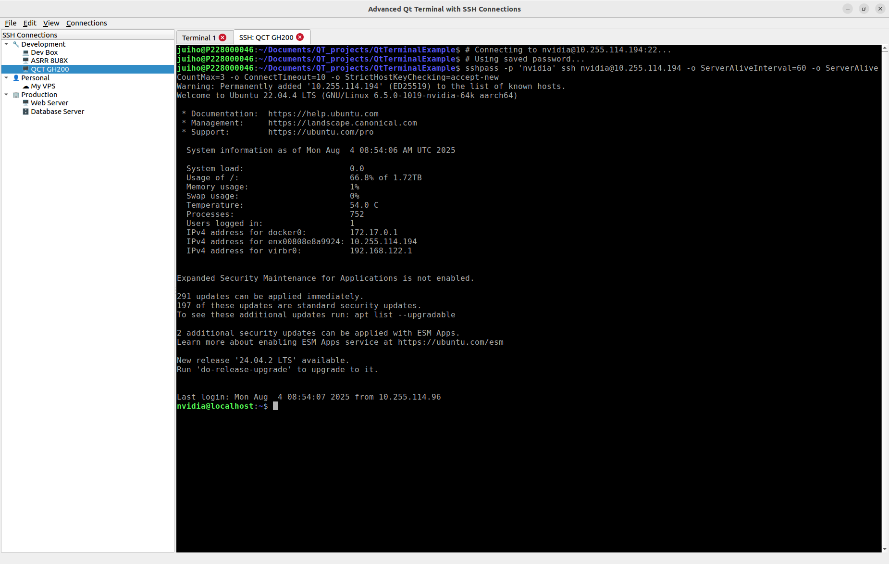

# Qt Terminal with SSH Connection Manager

A modern Qt-based terminal emulator with built-in SSH connection management, inspired by mRemoteNG but focused on terminal connections. Features a split-pane interface with connection tree, detailed connection panel, and multi-tab terminal area.



## Features

### ✅ Implemented Features
- **🖥️ Multi-tab Terminal Interface** - Full qtermwidget integration with tabbed terminals
- **🌳 Split-Pane SSH Connection Manager** - Three-panel layout with connection tree, details panel, and terminals
- **📋 Connection Details Panel** - Live connection information with quick-connect buttons
- **📁 Visual Connection Organization** - Folder structure with distinctive emoji icons
- **🔑 Password Authentication** - Secure password storage with show/hide toggle (optional)
- **🔌 One-Click SSH Connections** - Automatic SSH with password authentication using sshpass
- **📤📥 File Transfer Capabilities** - SCP upload/download with visual file browser
- **💾 Persistent JSON Storage** - Automatic save/load of connections and settings
- **🔍 Connection Testing** - Ping-based connectivity testing before connecting
- **⌨️ Rich Keyboard Shortcuts** - Standard terminal shortcuts plus connection management
- **🔤 Font Management** - Customizable fonts with zoom controls (Ctrl++ / Ctrl+-)
- **🎨 Multiple Color Schemes** - Various terminal color themes
- **📊 Comprehensive Status Bar** - Font info, tab count, connection count, and activity status
- **🚀 Auto Host Key Management** - Automatic SSH host key acceptance for new connections
- **💡 Smart Connection Validation** - Input validation and error handling with helpful feedback

### 🚧 Planned Features
- **🔐 SSH Key Management** - Integration with SSH agent and key files
- **📈 Connection History** - Track and quick-access recent connections
- **🔍 Quick Connect Search** - Fast connection search and filtering
- **🎯 Import/Export** - Share connection configurations (JSON, CSV, other formats)
- **🔒 Password Encryption** - Secure encrypted password storage options

## Interface Layout

The application features a modern three-panel layout:

### Left Panel (Split Vertically)
- **Top: Connection Tree** - Hierarchical view of SSH connections organized by folders
- **Bottom: Connection Details** - Live details of selected connection with action buttons

### Right Panel
- **Multi-Tab Terminal Area** - Terminal tabs with close buttons and context menus

### Navigation Features
- **Resizable Splitters** - Drag to resize panels with visual grip handles
- **Collapsible Panels** - Minimize panels as needed (panels maintain minimum widths)
- **Context Menus** - Right-click anywhere for relevant actions

## Connection Management

### Connection Organization
Connections are organized into folders with distinctive emoji icons:

- **🏢 Production** - Live servers and production environments
- **🔧 Development** - Development and staging servers  
- **👤 Personal** - Personal VPS and cloud instances
- **🧪 Testing** - Test servers and QA environments
- **🚀 Staging** - Pre-production staging environments
- **📁 Custom** - User-defined folder names

### Connection Types
Connection types are automatically detected and iconized:
- **🖥️ Web Servers** - Web, WWW, HTTP servers
- **🗄️ Databases** - Database, DB, SQL servers  
- **💻 Development** - Dev boxes and development servers
- **🧪 Test Servers** - Testing and QA servers
- **☁️ Cloud/VPS** - Cloud instances and VPS servers

### Connection Details Panel
The bottom-left panel shows comprehensive connection information:
- **Connection Name** - Display name with folder context
- **Host Information** - Hostname/IP address and port
- **Authentication** - Username and password status (shows "••••••••" if password saved)
- **Quick Actions** - Connect, Edit, and Delete buttons
- **Real-time Updates** - Panel updates automatically when selecting different connections

## Password Authentication

### Password Security Features
- **Optional Storage** - Password field is completely optional
- **Show/Hide Toggle** - Connection dialog includes visibility toggle while typing
- **Status Indicators** - Connection tooltips and details panel show password status
- **Automatic Authentication** - Uses `sshpass` for seamless login when password is available

### Security Considerations
- **Local Storage** - Passwords stored in `~/.config/QtTerminalExample/connections.json`
- **Plain Text Warning** - Currently stored unencrypted (encryption planned)
- **File Permissions** - Ensure config directory has appropriate permissions (600/700)
- **Production Recommendation** - SSH keys preferred for production environments

### SSH Host Key Management
- **Automatic Acceptance** - Uses `-o StrictHostKeyChecking=accept-new` for new hosts
- **Known Hosts Integration** - New keys automatically added to `~/.ssh/known_hosts`
- **Security Balance** - Prevents hanging on first connections while maintaining security for changed keys
- **Manual Override** - Pre-populate known_hosts for maximum security if desired

## File Transfer Capabilities

### SCP Integration
- **Upload Files** - Drag-and-drop or browse to upload files to remote servers
- **Download Files** - Browse remote directories and download files
- **Remote File Browser** - Visual directory navigation with file type icons
- **Progress Dialogs** - Real-time upload/download progress with cancel option
- **Error Handling** - Comprehensive error messages with suggested solutions

### Remote Directory Navigation
- **Auto-Detection** - Automatically detects remote working directory
- **Visual Browser** - File listing with icons (📁 directories, 📄 files, ⚙️ executables)
- **Directory Navigation** - Navigate up/down directory tree
- **Manual Path Entry** - Direct path input for advanced users
- **File Size Display** - Shows file sizes and permissions

### Context Menu Integration
Right-click on SSH terminal tabs to access:
- **📤 Upload File to Server** - Select local file and remote destination
- **📥 Download File from Server** - Browse and download remote files
- **📂 Browse Remote Files** - Explore remote directory structure

## Requirements

### System Requirements
- **Qt 5.12+** or **Qt 6.x**
- **qtermwidget5** library
- **Linux/Unix** system (tested on Ubuntu 20.04+, Debian 11+)
- **C++11** compatible compiler (GCC 7+ or Clang 7+)
- **CMake 3.10+** or **qmake**

### Runtime Dependencies  
- **OpenSSH client** - For SSH connections (`openssh-client` package)
- **sshpass** - For automatic password authentication (optional but recommended)
- **ping utility** - For connection testing (usually pre-installed)

## Installation

### Install System Dependencies

**Ubuntu/Debian:**
```bash
sudo apt update
sudo apt install qtbase5-dev qtermwidget5-dev build-essential cmake \
                 openssh-client sshpass iputils-ping
```

**Fedora/RHEL:**
```bash
sudo dnf install qt5-qtbase-devel qtermwidget-qt5-devel gcc-c++ make cmake \
                 openssh-clients sshpass iputils
```

**Arch Linux:**
```bash
sudo pacman -S qt5-base qtermwidget cmake openssh sshpass iputils
```

### Build Application

**With CMake (Recommended):**
```bash
git clone https://github.com/yourusername/QtTerminalExample.git
cd QtTerminalExample
mkdir build && cd build
cmake ..
make -j$(nproc)
```

**With qmake (Alternative):**
```bash
git clone https://github.com/yourusername/QtTerminalExample.git
cd QtTerminalExample
qmake
make -j$(nproc)
```

### Run Application
```bash
./QtTerminalExample
```

### Desktop Integration (Optional)
```bash
# Create desktop entry
mkdir -p ~/.local/share/applications
cat > ~/.local/share/applications/qt-terminal.desktop << EOF
[Desktop Entry]
Name=Qt Terminal SSH Manager
Comment=Terminal with SSH Connection Management
Exec=/path/to/QtTerminalExample
Icon=terminal
Type=Application
Categories=System;TerminalEmulator;
EOF
```

## Usage Guide

### Terminal Operations
- **New Tab** - `Ctrl+T` or File → New Tab or right-click tab bar
- **Close Tab** - `Ctrl+W` or click × on tab or right-click → Close Tab
- **Switch Tabs** - `Ctrl+PageUp/PageDown` or click tab headers
- **Copy** - `Ctrl+C` in terminal or right-click → Copy
- **Paste** - `Ctrl+V` in terminal or right-click → Paste
- **Select All** - `Ctrl+A` or right-click → Select All
- **Clear Terminal** - Right-click → Clear or `Ctrl+L`

### Font and Display
- **Increase Font** - `Ctrl++` or View → Zoom In
- **Decrease Font** - `Ctrl+-` or View → Zoom Out
- **Reset Font** - `Ctrl+0` or View → Reset Zoom
- **Font Dialog** - View → Font... for comprehensive font selection
- **Color Schemes** - View → Color Scheme to cycle through themes

### Connection Management
- **New Connection** - `Ctrl+N` or Connections → New Connection
- **Quick Connect** - Select connection → click "🔌 Quick Connect" button
- **Double-Click Connect** - Double-click any connection for instant SSH
- **Edit Connection** - Select connection → click "✏️ Edit" or right-click → Edit
- **Delete Connection** - Select connection → click "🗑️ Delete" or right-click → Delete
- **Test Connectivity** - Use "Test Connection" button in connection dialog
- **Add to Folder** - Right-click folder → "Add Connection to [Folder]"

### File Transfer Operations
- **Upload File** - Right-click SSH tab → "📤 Upload File to Server"
- **Download File** - Right-click SSH tab → "📥 Download File from Server"
- **Browse Files** - Right-click SSH tab → "📂 Browse Remote Files"
- **Progress Monitoring** - Watch progress dialogs during transfers
- **Error Recovery** - Review error messages for connection issues

### Interface Management
- **Resize Panels** - Drag the splitter handles between panels
- **Connection Details** - Click any connection to see details in bottom-left panel
- **Refresh Connections** - `F5` or Connections → Refresh
- **Status Information** - Check status bar for font, tab count, and connection count

## Configuration

### Connection Storage
- **File Location** - `~/.config/QtTerminalExample/connections.json`
- **Format** - JSON with connection details, passwords, and organization
- **Backup Strategy** - Regularly backup your connections file
- **Auto-Recovery** - Application creates defaults if file is missing or corrupted

### Security Configuration
Secure your connection data:
```bash
# Set proper permissions on config directory
chmod 700 ~/.config/QtTerminalExample
chmod 600 ~/.config/QtTerminalExample/connections.json

# Backup connections securely
cp ~/.config/QtTerminalExample/connections.json ~/connections-backup.json.$(date +%Y%m%d)
```

### Application Settings
- **Qt Settings Storage** - Window geometry, fonts, and UI preferences
- **Automatic Persistence** - Settings saved automatically on exit
- **Manual Reset** - Delete `~/.config/QtTerminalExample/` to reset all settings

## Advanced Features

### SSH Connection Options
All SSH connections use optimized settings:
- **Keep-Alive** - `ServerAliveInterval=60` and `ServerAliveCountMax=3`
- **Host Key Policy** - `StrictHostKeyChecking=accept-new` for new connections
- **Connection Timeout** - Automatic timeouts for failed connections
- **Multi-Port Support** - Custom SSH ports supported with validation

### Terminal Enhancements
- **Large History Buffer** - 200,000 line history per terminal
- **Smart Font Scaling** - Synchronized font changes across all terminals
- **Session Persistence** - Terminal state maintained during SSH reconnections
- **Tab Management** - Intelligent tab titling and close behavior

### Error Handling & Recovery
- **Connection Validation** - Pre-connection testing and validation
- **Friendly Error Messages** - User-friendly error descriptions with suggested fixes
- **Automatic Retries** - Built-in retry logic for temporary failures
- **Fallback Options** - Graceful degradation when optional tools unavailable

## Keyboard Shortcuts Reference

| Action | Shortcut | Context |
|--------|----------|---------|
| **File Operations** |  |  |
| New Tab | `Ctrl+T` | Global |
| Close Tab | `Ctrl+W` | Global |
| Quit Application | `Ctrl+Q` | Global |
| **Connection Management** |  |  |
| New Connection | `Ctrl+N` | Global |
| Refresh Connections | `F5` | Global |
| **Terminal Operations** |  |  |
| Copy | `Ctrl+C` | In Terminal |
| Paste | `Ctrl+V` | In Terminal |
| Select All | `Ctrl+A` | In Terminal |
| **View Controls** |  |  |
| Zoom In | `Ctrl++` | Global |
| Zoom Out | `Ctrl+-` | Global |
| Reset Zoom | `Ctrl+0` | Global |

## Troubleshooting

### Installation Issues

**"qtermwidget not found during build"**
```bash
# Ubuntu/Debian - install development package
sudo apt install qtermwidget5-dev

# Find installation location
find /usr -name "qtermwidget*.h" 2>/dev/null
```

**"CMake configuration failed"**
```bash
# Ensure Qt development tools are installed
sudo apt install qt5-qmake qtbase5-dev-tools

# For Qt6, use:
sudo apt install qt6-base-dev qt6-tools-dev
```

### Runtime Issues

**"sshpass command not found" warning**
```bash
# Install sshpass for automatic password authentication
sudo apt install sshpass

# Without sshpass, manual password entry is required
# The application will show a warning but continue to function
```

**"Connection hangs on first SSH attempt"**
- This occurs when SSH encounters an unknown host key
- The application automatically handles this with `StrictHostKeyChecking=accept-new`
- For maximum security, manually verify host keys first:
```bash
ssh-keyscan -H hostname >> ~/.ssh/known_hosts
```

**"Permission denied" for connections.json**
```bash
# Fix file permissions
chmod 600 ~/.config/QtTerminalExample/connections.json
chmod 700 ~/.config/QtTerminalExample/
```

### Connection Problems

**"Authentication failed" with correct password**
- Server might have disabled password authentication
- Check server SSH config: `PasswordAuthentication yes`
- Try manual SSH connection to verify: `ssh user@host`
- Consider using SSH keys for better security

**"Host unreachable" errors**
- Verify network connectivity: `ping hostname`
- Check firewall settings on both client and server
- Ensure SSH service is running on server: `sudo systemctl status ssh`

**"File transfer fails"**
- Verify SCP access on server (usually enabled with SSH)
- Check file permissions on remote server
- Ensure sufficient disk space for transfers
- Try manual SCP to test: `scp file user@host:/path/`

### Display Issues

**"Application shows blank or corrupted display"**
```bash
# Force X11 platform (application does this automatically)
export QT_QPA_PLATFORM=xcb
./QtTerminalExample

# For Wayland users experiencing issues
export QT_QPA_PLATFORM=wayland
```

**"Font size too small/large"**
- Use `Ctrl++` and `Ctrl+-` to adjust font size
- Or go to View → Font... for detailed font selection
- Settings are automatically saved between sessions

## Development

### Project Structure
```
QtTerminalExample/
├── main.cpp                 # Application entry point with platform setup
├── terminalwindow.h/.cpp    # Main window with three-panel interface
├── connectiondialog.h/.cpp  # Connection add/edit dialog with password support
├── CMakeLists.txt           # CMake build configuration
├── QtTerminalExample.pro    # qmake project file (alternative)
└── README.md               # This comprehensive documentation
```

### Key Classes
- **TerminalWindow** - Main application window with split-pane interface
- **ConnectionDialog** - Add/edit connection dialog with validation
- **SSHConnection** - Connection data structure with password support
- **GripSplitter/GripSplitterHandle** - Custom splitter with visual drag handles

### Code Features
- **Modern Qt Practices** - Uses Qt 5.12+ features and best practices
- **Memory Management** - Proper object ownership and cleanup
- **Error Handling** - Comprehensive error handling throughout
- **Validation** - Input validation and user feedback
- **Security Focus** - Safe command construction and password handling

### Contributing
1. **Fork Repository** - Create your own fork for development
2. **Feature Branches** - Use feature branches for new functionality
3. **Code Standards** - Follow Qt coding conventions and C++ best practices
4. **Testing** - Test on multiple Linux distributions
5. **Documentation** - Update documentation for new features
6. **Security Review** - Consider security implications, especially for password-related features

## Version History

### v0.5 (Current)
- ✅ **Split-Pane Interface** - Three-panel layout with connection tree, details panel, and terminals
- ✅ **Connection Details Panel** - Live connection information with quick-action buttons
- ✅ **Enhanced File Transfer** - Visual remote file browser with directory navigation
- ✅ **Improved Error Handling** - Comprehensive error messages and validation
- ✅ **Visual Splitters** - Custom grip handles for panel resizing
- ✅ **Tab Context Menus** - File transfer options in terminal tab menus

### v0.4
- ✅ **Password Support** - Complete password field implementation
- ✅ **sshpass Integration** - Automatic password authentication
- ✅ **Connection Testing** - Ping-based connectivity testing
- ✅ **Enhanced Security** - SSH host key management and validation

### v0.3
- ✅ **SSH Connections** - Full SSH terminal implementation
- ✅ **Connection Management** - Add/edit/delete dialogs
- ✅ **JSON Persistence** - Reliable connection storage

### v0.2
- ✅ **Connection Tree** - Folder-based organization with emoji icons
- ✅ **Basic UI** - Multi-tab terminal interface

### v0.1
- ✅ **Terminal Foundation** - Basic qtermwidget integration

## Roadmap

### Short Term (v0.6)
- **🔐 SSH Key Management** - Integration with SSH agent and key files
- **📋 Connection Import/Export** - JSON, CSV, and other format support
- **🔍 Quick Connect Bar** - Fast connection search and recent connections
- **📈 Connection History** - Track and manage connection history

### Medium Term (v0.7)
- **🔒 Password Encryption** - Secure encrypted password storage using Qt's cryptographic functions
- **🎨 Themes & Customization** - Application themes and enhanced UI customization
- **📊 Connection Statistics** - Usage tracking and connection analytics
- **🌐 Remote Tunneling** - SSH tunnel management and port forwarding

### Long Term (v1.0)
- **🔌 Plugin System** - Extensible plugin architecture for additional protocols
- **📝 Session Scripting** - Automation and scripting capabilities
- **📁 Remote File Manager** - Full-featured remote file management interface
- **📹 Session Recording** - Terminal session recording and playback

## Security Best Practices

### Password Security
1. **File Permissions** - Secure your configuration directory:
   ```bash
   chmod 700 ~/.config/QtTerminalExample
   chmod 600 ~/.config/QtTerminalExample/connections.json
   ```

2. **SSH Keys Preferred** - For production environments:
   ```bash
   ssh-keygen -t ed25519 -b 4096
   ssh-copy-id user@hostname
   ```

3. **Regular Backups** - Backup connections with proper security:
   ```bash
   cp ~/.config/QtTerminalExample/connections.json ~/secure-backup/
   chmod 600 ~/secure-backup/connections.json
   ```

### Network Security
- **VPN Usage** - Use VPN for connections over untrusted networks
- **Key Rotation** - Regularly rotate SSH keys and passwords
- **Monitoring** - Monitor server logs for unauthorized access attempts
- **Firewall Rules** - Implement proper firewall rules on servers

### Development Security
- **Code Review** - All password-related code should be reviewed
- **Static Analysis** - Use static analysis tools for security scanning
- **Dependency Updates** - Keep Qt and system libraries updated
- **Secure Coding** - Follow secure coding practices for command execution

## Feature Comparison

| Feature | Status | Description |
|---------|--------|-------------|
| **Core Functionality** |  |  |
| Multi-tab Terminal | ✅ Complete | Full qtermwidget integration with tabbed interface |
| Split-Pane Interface | ✅ Complete | Three-panel layout with resizable splitters |
| SSH Connections | ✅ Complete | One-click SSH with automatic authentication |
| Connection Tree | ✅ Complete | Hierarchical folder organization with emoji icons |
| **Connection Management** |  |  |
| Connection Details Panel | ✅ Complete | Live connection information with action buttons |
| Password Storage | ✅ Complete | Optional password field with show/hide toggle |
| Connection Testing | ✅ Complete | Ping-based connectivity validation |
| JSON Persistence | ✅ Complete | Automatic save/load with error recovery |
| **File Transfer** |  |  |
| SCP Upload/Download | ✅ Complete | Visual file transfer with progress dialogs |
| Remote File Browser | ✅ Complete | Directory navigation with file type icons |
| Error Handling | ✅ Complete | Comprehensive error messages and recovery |
| **Advanced Features** |  |  |
| SSH Key Support | 🚧 Planned | Integration with SSH agent and key files |
| Password Encryption | 🚧 Planned | Secure encrypted storage implementation |
| Connection History | 🚧 Planned | Recent connections and usage tracking |
| Import/Export | 🚧 Planned | Configuration sharing and migration tools |

## API Documentation

### Core Classes

**SSHConnection Structure:**
```cpp
struct SSHConnection {
    QString name;        // Display name for connection
    QString host;        // Hostname or IP address  
    QString username;    // SSH username
    QString password;    // SSH password (optional, stored in plain text)
    int port;           // SSH port (default: 22)
    QString folder;     // Organization folder name
};
```

**Key Methods:**
```cpp
// Terminal creation
QTermWidget* createSSHTerminal(const SSHConnection &connection);

// Connection management  
void loadConnections();
void saveConnections();
void addNewConnection();
void editConnection(QTreeWidgetItem *item);

// File operations
void uploadFileToSSH(const SSHConnection &connection);
void downloadFileFromSSH(const SSHConnection &connection);
```

## Community & Support

### Getting Help
- **GitHub Issues** - [Report bugs and request features](../../issues)
- **GitHub Discussions** - [Ask questions and share ideas](../../discussions)
- **Documentation** - Check this README and inline code comments
- **Examples** - Review the default connections for usage examples

### Contributing
- **Bug Reports** - Use GitHub Issues with detailed reproduction steps
- **Feature Requests** - Describe use cases and expected behavior
- **Pull Requests** - Follow coding standards and include tests
- **Documentation** - Help improve documentation and examples

### Security
- **Vulnerability Reports** - Report security issues privately via email
- **Security Best Practices** - Follow the security guidelines in this README
- **Code Review** - All security-related changes undergo thorough review

## Acknowledgments

- **[Qt Framework](https://www.qt.io/)** - Cross-platform application framework
- **[qtermwidget](https://github.com/lxqt/qtermwidget)** - Terminal widget implementation
- **[mRemoteNG](https://mremoteng.org/)** - Inspiration for connection management UX
- **[sshpass](https://sourceforge.net/projects/sshpass/)** - Password automation for SSH
- **OpenSSH Community** - SSH protocol implementation and tools
- **Linux Terminal Community** - Feedback, testing, and feature suggestions

## License

This project is licensed under the MIT License.

## Author

**Qt Terminal with SSH Connection Manager**  
*Modern terminal emulation with integrated SSH connection management*

Created with ❤️ for efficient Linux system administration and development workflows.

---

**Current Status**: Active Development | **Version**: 0.5 | **Next Milestone**: SSH Key Management  

*Streamline your SSH workflow with visual connection management* 🚀